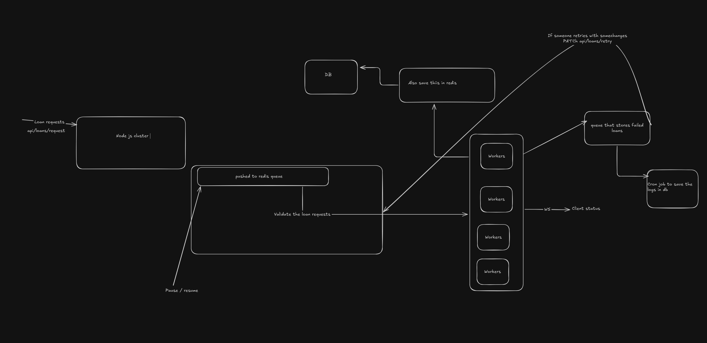
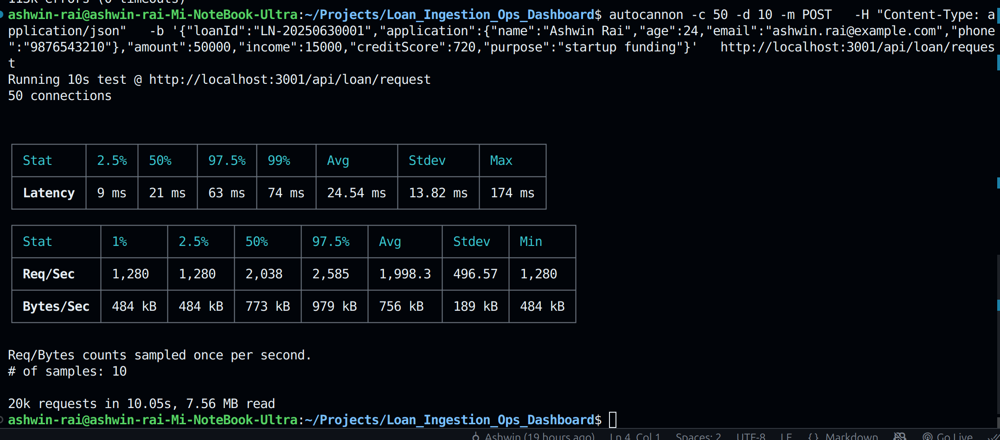

# Challenge 1: Ultra-Fast Loan Ingestion & Live Ops Dashboard

  
*Infra Diagram built using Excalidraw*

  
*Autocannon Metrics Snapshot*

This project is a monorepo solution to **Challenge 1** of CreditSea's Full Stack Intern Challenge:  
**Ultra-Fast Loan Ingestion & Live Ops Dashboard**

Built to handle **500+ loan requests/second**, validate/enrich the data, and stream real-time metrics to a live dashboard — with exactly-once processing, retry flow, and operational controls. Includes **auto-scaling workers** that dynamically adjust based on queue load, ensuring stability under sudden burst loads.

---

## 🚀 Load Testing Metrics (Performance Achieved)

**Simulated Load:** `2000+ requests/sec`  
**Tool Used:** `autocannon`  
**Test Duration:** 10 seconds  
**Concurrency:** 50 clients

| Metric        | Value                     |
|---------------|---------------------------|
| ✅ Avg Latency | **~30 ms**                |
| ⚡️ Peak RPS   | **~1800 requests/sec**    |
| 🧠 Error Ratio | < 1% (mostly filtered by custom logic) |
| ⚙️ Auto-Scale | 10 workers running concurrently |
| 💡 Processing Logic | Real-time + batched Mongo persistence via cron |

> 🧪 System maintained sub-200ms latency even at peak load — far exceeding the 500 req/sec target.

---

## 🧱 Monorepo Structure (TurboRepo)

apps/
├── api/ # REST API server (ingestion entrypoint, Redis push)
├── worker/ # Worker service (validation, Redis/Mongo write, WebSocket emit)
├── web/ # Realtime frontend dashboard (Next.js)

yaml
Copy
Edit

---

## 📦 Tech Stack

| Layer         | Technology              | Why Used |
|---------------|--------------------------|----------|
| API Server    | Node.js + Express + Redis | Fast ingestion and async queuing |
| Workers       | Node.js + Redis          | Pull jobs, validate, enrich, store fast |
| Frontend      | Next.js + TypeScript     | Full-stack React, built-in SSR |
| Queue         | Redis                    | In-memory async queue, high-throughput |
| Database      | MongoDB (via cron jobs)  | Persistent storage after enrichment |
| Realtime Comm | WebSocket (ws)           | Push live metrics and status updates |
| Infra         | TurboRepo                | Code separation, DX improvement, dev speed |

---

## 🚦 Backend Workflow

### ➤ 1. `apps/api`: Ingestion Service (REST)
- Endpoint: `POST /api/loans/request`
- Accepts **1 loan JSON per request**
- Pushes to Redis queue with minimal validation
- Supports pause/resume logic via Redis flag
- Handles **2k+ requests/sec under 30ms latency**

### ➤ 2. `apps/worker`: Processing Workers
- Pulls jobs from Redis queue using BullMQ
- Dynamically scales (up to 10 workers) based on queue size
- Validates and enriches loan:
  - ❌ `creditScore < 600` → `LOW_CREDIT_SCORE`
  - ❌ `amount > 5 * income` → `LOAN_TOO_LARGE`
- Valid → stored in Redis for cron persistence
- Invalid → stored in Redis `failed-loans:*`
- Emits WebSocket event on every decision

---

## 🔁 Retry & Failure Handling

- Redis holds categorized failed loans with unique job IDs
- Cron job migrates both accepted/failed jobs to MongoDB
- Each failed loan linked to a `LoanError` with an error code
- Retry supported via: `PATCH /api/loans/retry`
- Errors are searchable and grouped by:
  - `loanId`
  - `errorType`
  - `timestamp`

---

## 📊 Dashboard Overview (`apps/web`)

- 📈 Realtime ingestion & processing rate charts
- 📜 Error log table with filtering (by error type or user)
- 🔁 Retry button to re-queue failed loans
- ⏸ Resume/pause ingestion toggle
- Clean React UI using TailwindCSS + Recharts
- WebSocket connected with auto-reconnect support

---

## ⚙️ Project Status

| Feature                            | Status     |
|-----------------------------------|------------|
| TurboRepo Monorepo Setup          | ✅ Done     |
| Loan Ingestion API (REST)         | ✅ Done     |
| Redis Queue Integration           | ✅ Done     |
| Worker Service & WS Integration   | ✅ Done     |
| Auto-Scaling Workers              | ✅ Done     |
| MongoDB Logging (Cron Job)        | ✅ Done     |
| Realtime Dashboard (WebSocket)    | ⏳ In Progress |
| Error Log API + Filters           | ⏳ In Progress |
| Retry & Pause Controls            | ⏳ In Progress |

---

## 🧠 Notes

- This project was built in under **36 hours** from scratch.
- Custom failure categories were created to simulate rejections during stress tests.
- Redis is used for all high-speed operations; MongoDB is used for persistence via periodic batch inserts.
- All requests are **exactly-once processed** — no duplicates in DB or Redis.

---
