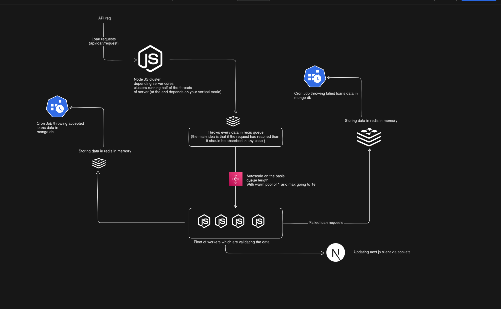

<h1>Challenge 1: Ultra-Fast Loan Ingestion &amp; Live Ops Dashboard</h1>

This project is a monorepo solution to **Challenge 1** of CreditSea's Full Stack Intern Challenge:  
**Ultra-Fast Loan Ingestion & Live Ops Dashboard**

Built to handle **500+ loan requests/second**, validate/enrich the data, and stream real-time metrics to a live dashboard — with exactly-once processing, retry flow, and operational controls.

---

## 🧱 Monorepo Structure (TurboRepo)

apps/
├── api/ # REST API server (ingestion entrypoint, Redis push)
├── worker/ # Worker service (validation, DB write, WebSocket emit)
├── web/ # Realtime frontend dashboard (Next.js)

yaml
Copy
Edit

---

## 📦 Tech Stack

| Layer         | Technology              | Why Used |
|---------------|--------------------------|----------|
| API Server    | Node.js + Express + Redis | Fast ingestion and async queuing |
| Workers       | Node.js + Redis + MongoDB | Pull jobs, validate, enrich, store |
| Frontend      | Next.js + TypeScript     | Full-stack React, built-in SSR |
| Queue         | Redis                    | In-memory async queue, high-throughput |
| Database      | MongoDB                  | Schema-less logs, flexible filters |
| Realtime Comm | WebSocket (ws)           | Push live metrics and status updates |
| Infra         | TurboRepo                | Code separation, DX improvement, dev speed |

---

## 🚦 Backend Workflow

### ➤ 1. `apps/api`: Ingestion Service (REST)
- Endpoint: `POST /api/loans/request`
- Accepts **1 loan JSON per request**
- Validates minimal fields and **pushes to Redis queue**
- Supports pause/resume logic via in-memory flag or Redis key
- Runs with `Node.js cluster` to support high concurrency on multicore CPUs

### ➤ 2. `apps/worker`: Processing Workers
- Subscribes to the Redis loan queue
- Each worker validates & enriches the loan data:
  - Required fields: loanId, amount, applicant info, creditScore, etc.
- Based on result:
  - ✅ Valid → save to MongoDB `loans`
  - ❌ Invalid → push to Redis `failedLoans` queue and emit error status
- Sends **real-time updates** to the dashboard via WebSocket:
  - Processing rate
  - Success/failure counts
  - Errors per applicant / type

---

## 🔁 Retry & Failure Handling

- Failed loans are stored in a separate Redis queue
- API endpoint: `PATCH /api/loans/retry` to retry failed loans
- Retries can include updated loan data (e.g., corrected fields)
- Cron job stores logs/errors to MongoDB for persistent queryability

---

## 📊 Dashboard Overview (`apps/web`)

- Realtime line charts: Ingestion vs. Processed rates
- Error logs with search filters: by `loanId`, `errorType`, `timestamp`
- Admin controls:
  - ⏸ Pause / ▶️ Resume ingestion
  - 🔁 Retry failed loans
- Handles auto-reconnection via WebSocket
- React-based UI built using Tailwind + Recharts

---

## ⚙️ Status

| Feature                            | Status     |
|-----------------------------------|------------|
| TurboRepo Monorepo Setup          | ✅ Done     |
| Loan Ingestion API (REST)         | ⏳ In Progress |
| Redis Queue Integration           | ⏳ In Progress |
| Worker Service & WS Integration   | 🔜 Upcoming |
| MongoDB Logging & Retry Logic     | 🔜 Upcoming |
| Realtime Dashboard                | 🔜 Upcoming |

---

> 🧠 This is being built from scratch under a 36-hour time limit. This README will evolve as features are completed